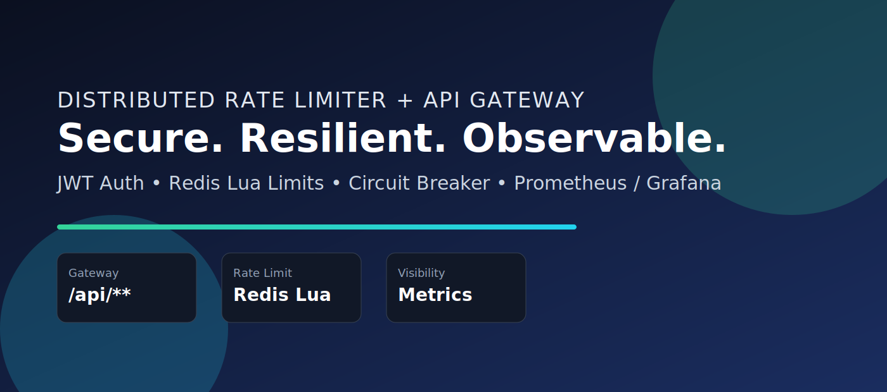
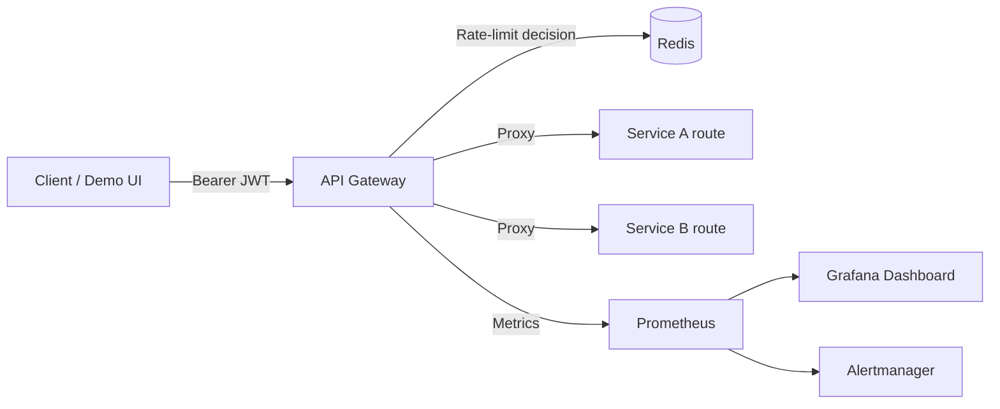
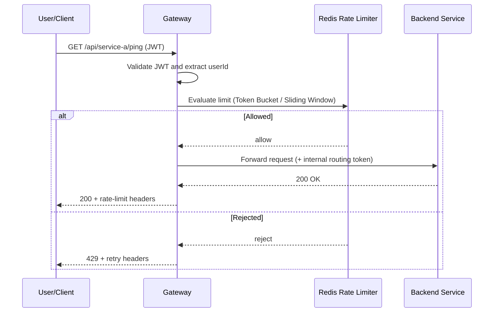
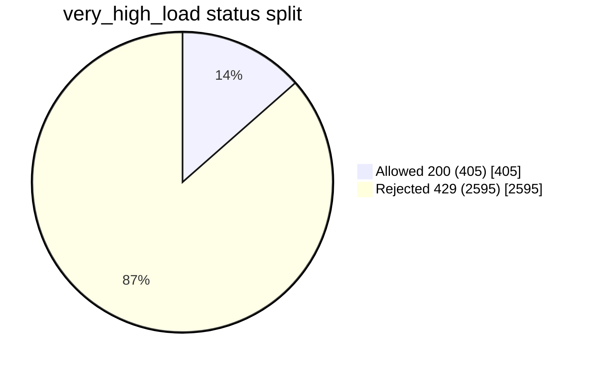
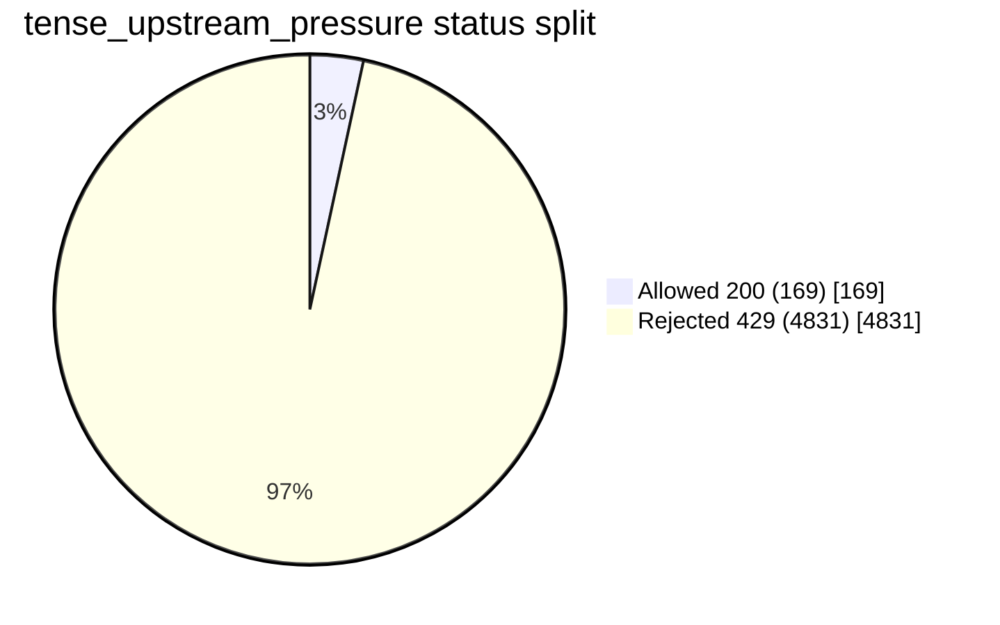

# Distributed Rate Limiter + API Gateway


Production-grade API Gateway built with Spring Boot + Redis, featuring JWT-aware distributed rate limiting, hardened security defaults, and resilience behavior under failures.



## How To Demo In 60 Seconds

1. Start dependencies and app:

```bash
set ACTUATOR_API_KEY=your-strong-actuator-key
set INTERNAL_ROUTING_TOKEN=your-strong-internal-routing-token
docker compose up --build
```

2. Mint a token:

```bash
curl -X POST "http://localhost:8080/auth/token?userId=demo-user"
```

3. Hit protected route:

```bash
curl -H "Authorization: Bearer <TOKEN>" "http://localhost:8080/api/service-a/ping"
```

4. Open visual demo:

```bash
http://localhost:8080/showcase
```

Expected result in one line: authenticated traffic passes, overload traffic gets controlled `429`, and behavior is visible in headers/metrics.

## Executive Summary

| Focus | Highlights |
|---|---|
| Problem solved | Protect backend services from burst traffic and abuse while preserving availability |
| Core mechanisms | JWT auth, distributed Redis rate limiting, fallback limiter, circuit breaker |
| Why it stands out | Includes demo UI, observability stack, CI pipeline, and Kubernetes manifests |
| Latest stress result | Extreme load produced controlled `429` rejections with `0` non-429 errors in final run snapshot |

## Quick Navigation

- [How To Demo In 60 Seconds](#how-to-demo-in-60-seconds)
- [Visual Snapshot](#visual-snapshot)
- [Architecture](#architecture)
- [Stress Test Graphs (High-Load Snapshot)](#stress-test-graphs-high-load-snapshot)
- [Quick Start (Docker)](#quick-start-docker)
- [Local Observability Stack](#local-observability-stack)
- [Production Readiness Checklist](#production-readiness-checklist)

## Visual Snapshot

| Area | Stack / Capability |
|---|---|
| Gateway Core | Spring Boot 3 + Java 21 |
| Distributed Limiting | Redis + Lua (atomic scripts) |
| Security | JWT auth + internal routing token + actuator key |
| Resilience | Circuit breaker + local fallback limiter |
| Observability | Actuator + Prometheus + Grafana + Alertmanager |



## What This Project Demonstrates

- JWT authentication middleware and user identity extraction
- Two rate limiting algorithms:
  - Token Bucket
  - Sliding Window Log
- Distributed enforcement with Redis + atomic Lua scripts
- Per-user and per-IP throttling behavior
- Strict JWT enforcement on `/api/**`
- Protected actuator endpoints with API key (`X-Actuator-Key`)
- Internal backend isolation using internal routing token
- Upstream timeout controls and graceful shutdown
- High concurrency test simulation with k6 (1000+ concurrent request rate)
- Failure handling:
  - Redis outage fallback to local in-memory limiter
  - Circuit breaker around Redis calls
- Metrics for throughput, rejects, latency, and Redis behavior

## Architecture

Client -> API Gateway (`/api/**`) -> Backend Services (`/backend/service-a`, `/backend/service-b`)

Redis is shared by gateway instances for distributed throttling consistency.

### Request Lifecycle Graph



## Endpoints

- `POST /auth/token?userId=alice` : issue test JWT (disabled in `prod` profile)
- `GET /api/service-a/ping` : proxied route, default Token Bucket
- `GET /api/service-b/ping` : proxied route, default Sliding Window Log
- `GET /actuator/health` : public health endpoint
- `GET /actuator/prometheus` : requires `X-Actuator-Key` header
- `GET /showcase` : live system demo UI

## Demo UI

Open:

```bash
http://localhost:8080/showcase
```

What it demonstrates live:

- Token generation (or manual token paste when token endpoint is disabled)
- Per-route behavior (`service-a` vs `service-b`) with live rate-limit headers
- Burst traffic test with allowed vs rejected distribution and average latency

## Quick Start (Docker)

```bash
set ACTUATOR_API_KEY=your-strong-actuator-key
set INTERNAL_ROUTING_TOKEN=your-strong-internal-routing-token
docker compose up --build
```

Then test manually:

```bash
curl -X POST "http://localhost:8080/auth/token?userId=alice"
curl -H "Authorization: Bearer <TOKEN>" "http://localhost:8080/api/service-a/ping"
curl -H "Authorization: Bearer <TOKEN>" "http://localhost:8080/api/service-b/ping"
curl -H "X-Actuator-Key: your-strong-actuator-key" "http://localhost:8080/actuator/prometheus"
```

## Deploy On Render

This repository now includes a Render Blueprint file:

- `render.yaml`

It provisions:

- One Docker web service for the gateway
- One managed Redis service for distributed rate limiting
- Optional Neon PostgreSQL integration via env vars (`DATABASE_URL`, `DATABASE_USERNAME`, `DATABASE_PASSWORD`)

### Deploy Steps

1. Push this project to a GitHub repository.
2. In Render, click **New +** -> **Blueprint**.
3. Select your repository and deploy.
4. Render reads `render.yaml`, creates the web + Redis services, and wires env vars automatically.

### Important Environment Notes

- `server.port` already honors Render's `PORT` variable.
- `SPRING_PROFILES_ACTIVE=prod,neon` is set in Blueprint.
- `GATEWAY_SECURITY_ALLOW_DEMO_TOKEN_ENDPOINT=true` is enabled for demo convenience.
- This gateway still requires Redis for distributed limiter state; Neon is configured as SQL database connectivity.

### Neon Configuration (Render)

Set these in your Render web service environment:

- `DATABASE_URL`: Neon JDBC URL, for example `jdbc:postgresql://<host>/<db>?sslmode=require`
- `DATABASE_USERNAME`: Neon database user
- `DATABASE_PASSWORD`: Neon database password

If your Neon connection string already includes credentials, you can still keep `DATABASE_USERNAME` and `DATABASE_PASSWORD` empty.

For stricter production hardening after demo, set:

- `GATEWAY_SECURITY_ALLOW_DEMO_TOKEN_ENDPOINT=false`

### Post-Deploy Smoke Checks

Replace `<render-url>` with your service URL:

```bash
curl "https://<render-url>/actuator/health"
curl -X POST "https://<render-url>/auth/token?userId=render-demo"
curl -H "Authorization: Bearer <TOKEN>" "https://<render-url>/api/service-a/ping"
```

## Run Locally (Without Docker)

1. Start Redis locally on `localhost:6379`
2. Run:

```bash
mvn spring-boot:run
```

## High Concurrency Load Test (k6)

```bash
k6 run load-tests/k6-rate-limit.js
```

## Stress Test Graphs (High-Load Snapshot)

Recorded run profile:

- `very_high_load`: 3000 requests, concurrency 240, delay 2ms
- `tense_upstream_pressure`: 5000 requests, concurrency 360, delay 25ms

### Outcome Split: Very High Load



### Outcome Split: Tense Upstream Pressure



### Performance Comparison

| Metric | very_high_load | tense_upstream_pressure |
|---|---:|---:|
| Requests | 3000 | 5000 |
| Concurrency | 240 | 360 |
| Allowed (200) | 405 | 169 |
| Rejected (429) | 2595 | 4831 |
| Other errors | 0 | 0 |
| Avg latency (ms) | 792.55 | 600.91 |
| P95 latency (ms) | 3996 | 2989 |
| Effective throughput (req/s) | 56.70 | 191.77 |

### Visual Throughput Comparison

```text
very_high_load          | ###########                              | 56.70 req/s
tense_upstream_pressure | ######################################   | 191.77 req/s
```

Interpretation:

- Under intense pressure, the gateway preserves service safety by aggressively enforcing `429`.
- The absence of non-429 failures in this snapshot indicates stable rejection behavior instead of crash behavior.

## CI Pipeline (GitHub Actions)

Pipeline file:

- `.github/workflows/ci.yml`

What it runs:

- Maven build and test (`mvn clean verify`)
- Docker image build validation
- Trivy filesystem vulnerability scan (HIGH/CRITICAL)

## Local Observability Stack

Artifacts added:

- `monitoring/prometheus.yml`
- `monitoring/alerting/rate-limiter-alerts.yml`
- `monitoring/alerting/alertmanager.yml`
- `monitoring/grafana/provisioning/datasources/datasource.yml`
- `monitoring/grafana/provisioning/dashboards/dashboards.yml`
- `monitoring/grafana/dashboards/rate-limiter-gateway-dashboard.json`

Start gateway + Redis + observability:

```bash
set ACTUATOR_API_KEY=change-me-actuator-key
set INTERNAL_ROUTING_TOKEN=change-me-internal-routing-token
set GRAFANA_ADMIN_PASSWORD=change-me-grafana-password
docker compose --profile observability up --build
```

Endpoints:

- Prometheus: `http://localhost:9090`
- Alertmanager: `http://localhost:9093`
- Grafana: `http://localhost:3000` (admin / value from `GRAFANA_ADMIN_PASSWORD`)

Important:

- Prometheus scraping of `/actuator/prometheus` uses `X-Actuator-Key` from `monitoring/prometheus.yml`.
- Keep `ACTUATOR_API_KEY` in compose env aligned with that value.

## Kubernetes Manifests (Kustomize)

Artifacts added:

- Base: `k8s/base/**`
- Production overlay: `k8s/overlays/prod/**`

Included resources:

- Gateway deployment/service/HPA/config/secret
- Redis deployment/service
- Optional ingress in prod overlay (`gateway.example.com` placeholder)

Deploy to Kubernetes:

1. Update secret placeholder values in `k8s/base/gateway/secret.yml`
2. Update image tag in `k8s/overlays/prod/kustomization.yml`
3. Apply overlay:

```bash
kubectl apply -k k8s/overlays/prod
```

Check rollout:

```bash
kubectl -n distributed-rate-limiter get pods
kubectl -n distributed-rate-limiter get svc
kubectl -n distributed-rate-limiter get hpa
```

## Production Controls

- `SPRING_PROFILES_ACTIVE=prod`:
  - disables demo token issuance endpoint
  - reduces health endpoint detail exposure
- `ACTUATOR_API_KEY`:
  - required for `/actuator/**` except `/actuator/health` and `/actuator/info`
- `INTERNAL_ROUTING_TOKEN`:
  - blocks direct external calls to `/backend/**`
  - gateway injects this token for internal proxy calls
- `UPSTREAM_CONNECT_TIMEOUT_MS` and `UPSTREAM_READ_TIMEOUT_MS`:
  - prevent slow upstream calls from consuming gateway worker threads

What to observe:

- Requests/sec handled (`http_reqs` from k6)
- Rejected requests (`429` count in k6 output)
- Latency under load (`http_req_duration`)
- Redis response time (`gateway_redis_latency`)
- Redis fallback/circuit events (`gateway_ratelimit_fallback_total`, `gateway_redis_circuit_open_total`)

## Demo Notes: Token Bucket vs Sliding Window Log

### Token Bucket

- Better for smoothing traffic bursts while preserving average rate
- Memory efficient (just token count + timestamp)
- Lower Redis storage overhead

### Sliding Window Log

- More accurate for hard "N requests in last T seconds" semantics
- Better when strict fairness is required
- Higher storage and compute cost (stores timestamps per request)

Rule of thumb:

- Prefer Token Bucket for most high-throughput APIs
- Prefer Sliding Window Log for strict abuse prevention controls

## Failure Handling Details

When Redis becomes slow/unavailable:

- Circuit breaker opens to prevent cascading latency
- Requests move to in-memory fallback limiter (degraded but functional)
- `fallbackMode=true` appears in 429 payloads and fallback metrics increase

This design keeps the gateway available during partial infrastructure failures.

## Production Readiness Checklist

- Rotate JWT secret and actuator/internal tokens using your secret manager
- Run at least 2 gateway replicas behind a load balancer
- Keep Redis in HA mode (Sentinel/Cluster) for real production traffic
- Scrape `/actuator/prometheus` with Prometheus and alert on 429 surge, fallback spikes, and circuit-open rates
- Run k6 load tests in CI before releases and compare baseline latency/reject metrics
# distributed-rate-limiter-gateway

